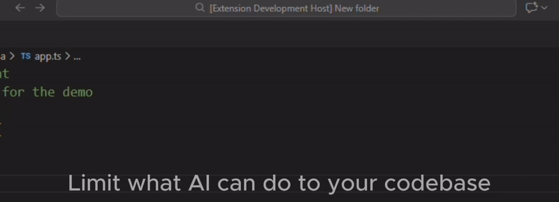
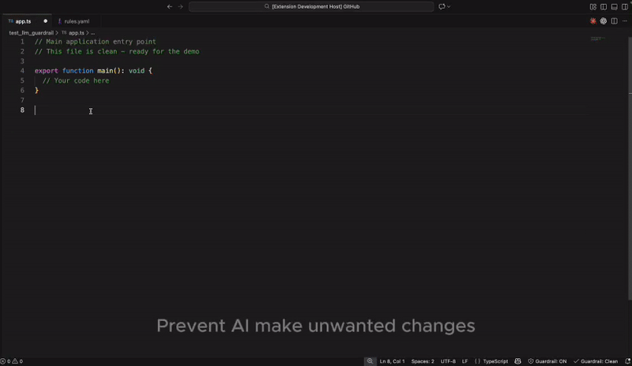
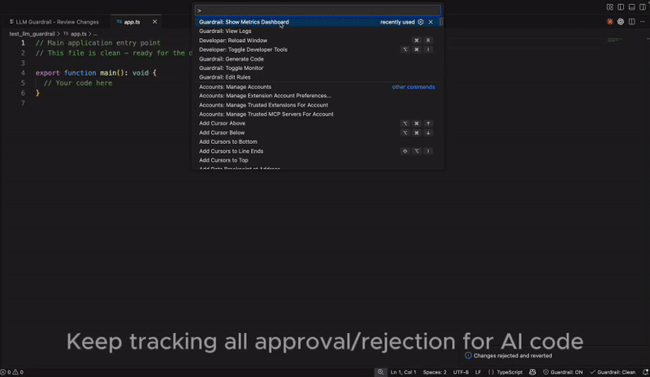
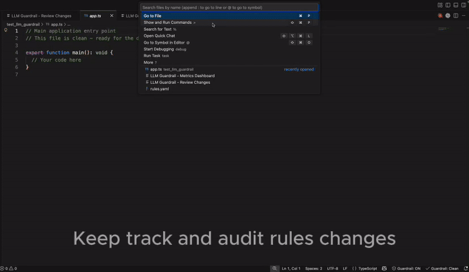

<div align="center">

# LLM Guardr41l

**AI changed more code than you asked for.**
**We stop that — before it turns into PR hell.**

[](https://marketplace.visualstudio.com/items?itemName=llm-guardr41l.llm-guardr41l)
[](https://marketplace.visualstudio.com/items?itemName=llm-guardr41l.llm-guardr41l)
[](https://opensource.org/licenses/MIT)
[](https://github.com/Anggi-Permana-Harianja/llm-guardr41l/actions/workflows/ci.yml)

[Install](https://marketplace.visualstudio.com/items?itemName=llm-guardr41l.llm-guardr41l) · [How It Works](#how-it-works-in-practice) · [Quick Start](#quick-start)

</div>

---

## The Problem

You asked AI to change one thing.
It touched multiple files.
Renamed variables.
Added dependencies you didn't ask for.

You only notice when tests fail or review explodes.

In teams, this turns into bloated PRs, review delays, and missed deadlines.

---

## What It Does

LLM Guardr41l sits between your AI tool and your codebase. You define boundaries in a `rules.yaml`. When AI-generated code crosses those boundaries, it gets caught immediately — not during code review, not after merge.

Works with Copilot, Cursor, Claude, ChatGPT pastes, and autonomous agents. No API interception. No vendor lock-in. Your code stays local.

---

## How It Works (In Practice)

### 1. Prevent — Define Boundaries

Set up rules that limit what AI can change. Block specific dependencies, forbid debug code, cap how many lines or files can change at once.



```yaml
rules:
  # Block forbidden dependencies
  - type: dependencies
    forbidden:
      - moment
      - jquery

  # No debugging artifacts
  - type: content
    forbid:
      - console.log
      - debugger

  # Limit blast radius
  - type: threshold
    max_lines_changed: 100
    max_files_changed: 5
```

### 2. Interrupt — Catch Violations Immediately

When AI-generated code breaks a rule, you see it right away. Reject to revert instantly, or approve and the rules update automatically.



### 3. Learn — See Patterns Over Time

Track what's getting approved, what's getting rejected, and which rules catch the most issues. Export to CSV when someone asks for numbers.



### 4. Trace — Know What Changed and When

Every approval, rejection, and rule change is logged. When someone asks "who allowed this?", you have the answer.



---

## For Developers

| What keeps happening | How this stops it |
|----------------------|-------------------|
| "AI changed files I didn't touch" | Scope rules restrict which files can be modified |
| "Who imported this random package?" | Dependency rules block unauthorized imports |
| "My PR is 300+ lines and I don't know why" | Threshold rules cap lines and files changed |
| "I approved something by mistake" | One-click reject to revert instantly |

### Works With Any AI Tool

- GitHub Copilot
- Cursor
- Claude
- ChatGPT pastes
- Autonomous agents

No API interception. No vendor lock-in. Your code stays local.

---

## For Engineering Managers

This is what changes when your team uses it:

- **Smaller PRs** — threshold rules stop AI from ballooning changes
- **Faster reviews** — violations caught before PR, not during review
- **Predictable delivery** — no more surprise rollbacks from AI-generated bugs
- **Fewer dependency surprises** — allowlist/blocklist what can be imported
- **Audit trail** — who approved what, when, logged automatically

### Team Workflow

1. Create `rules.yaml` with your team's boundaries
2. Commit it to the repo — everyone follows the same rules
3. Violations get caught in the editor, before code hits PR
4. Rules adapt over time as the team learns what to allow

---

## Quick Start

**1. Install the extension**

```
ext install llm-guardr41l.llm-guardr41l
```

Or search "LLM Guardr41l" in VS Code Extensions.

**2. Create `rules.yaml` in your project root**

```yaml
rules:
  - type: dependencies
    forbidden:
      - moment
      - jquery

  - type: content
    forbid:
      - console.log
      - debugger

  - type: threshold
    max_lines_changed: 50
    require_approval: true

global:
  require_approval_for_all: true
```

**3. Start coding.** Violations are caught automatically.

---

## CI/CD Integration

Gate PRs before they're opened:

```yaml
# GitHub Actions
- name: Check AI code changes
  run: npx llm-guardr41l check --staged

- name: Upload to GitHub Code Scanning
  uses: github/codeql-action/upload-sarif@v2
  with:
    sarif_file: results.sarif
```

```bash
# Pre-commit hook
#!/bin/sh
npx llm-guardr41l check --staged || exit 1
```

---

## CLI Tool

For CI/CD, pre-commit hooks, and automation.

```bash
# Install globally
npm install -g llm-guardr41l

# Or use npx (no install)
npx llm-guardr41l check --staged
```

### Commands

```bash
# Check staged changes
guardrail check --staged

# Check a specific commit
guardrail check --commit <sha>

# Initialize rules
guardrail init --template standard
```

### Output Formats

```bash
# Human-readable (default)
guardrail check --staged

# JSON (for scripts)
guardrail check --staged --format json

# SARIF (for GitHub Code Scanning)
guardrail check --staged --format sarif --output results.sarif
```

---

## Presets

Don't write rules from scratch. Pick a starting point:

| Preset | Best For | Description |
|--------|----------|-------------|
| **[safe-default](rules-examples/safe-default.yaml)** | Most teams | Balanced boundaries. **Start here.** |
| **[no-surprises](rules-examples/no-surprises.yaml)** | Scope control | Stop AI from touching unexpected files |
| **[dependency-lockdown](rules-examples/dependency-lockdown.yaml)** | Supply chain | All new dependencies blocked by default |
| **[enterprise-safe](rules-examples/enterprise-safe.yaml)** | SOC2, HIPAA, PCI | Full audit trail, compliance patterns |

```bash
# Download a preset
curl -o rules.yaml https://raw.githubusercontent.com/Anggi-Permana-Harianja/llm-guardr41l/main/rules-examples/safe-default.yaml
```

---

## Rule Types

| Type | What It Stops | Example |
|------|---------------|---------|
| **Dependencies** | Unwanted packages | Block `moment`, allow `date-fns` |
| **Content** | Debug code, unsafe patterns | No `console.log`, no `eval` |
| **Threshold** | Blast radius | Max 100 lines, max 5 files |
| **Scope** | AI touching wrong files | Only `src/feature.ts` |
| **Refactor** | Unwanted renames/changes | Block variable renames |

---

## Audit Trail

Every action is logged to `.llm-guardrail/logs.json`:

- Violations detected
- Approvals and rejections
- Rule changes (when `rules.yaml` is updated via approval)

View logs: `Guardrail: View Logs` in Command Palette.

---

## Installation

### VS Code Extension

**From Marketplace:**
1. Open VS Code
2. Go to Extensions (Cmd+Shift+X / Ctrl+Shift+X)
3. Search "LLM Guardr41l"
4. Click Install

**From Source:**
```bash
git clone https://github.com/Anggi-Permana-Harianja/llm-guardr41l.git
cd llm-guardr41l
npm install
npm run package
# Install the generated .vsix file
```

### CLI Tool

```bash
npm install -g llm-guardr41l
```

---

## Open Source

MIT licensed. Audit it. Extend it. No data leaves your machine.

---

## Roadmap

- [x] Core rule engine
- [x] Real-time detection
- [x] Approve and update rules
- [x] Metrics dashboard
- [x] Audit logging
- [x] CLI for CI/CD
- [x] SARIF output for GitHub
- [ ] JetBrains port (help wanted!)
- [ ] Neovim plugin

## Contributing

Contributions welcome! See [CONTRIBUTING.md](CONTRIBUTING.md).

## License

[MIT](LICENSE)

---

<div align="center">

**Stop AI from breaking what works.**

[Install from Marketplace](https://marketplace.visualstudio.com/items?itemName=llm-guardr41l.llm-guardr41l) · [GitHub](https://github.com/Anggi-Permana-Harianja/llm-guardr41l)

</div>
